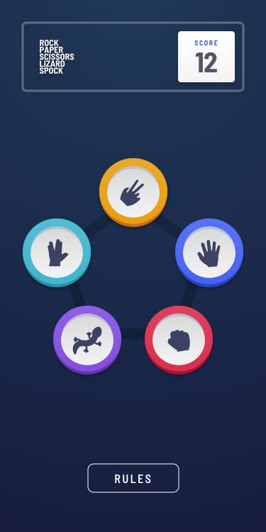
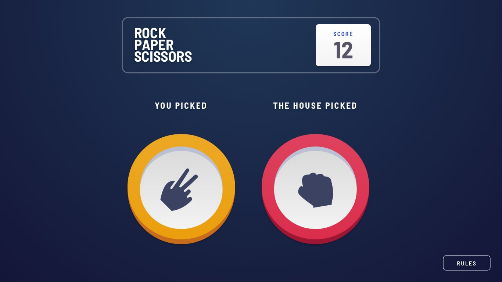
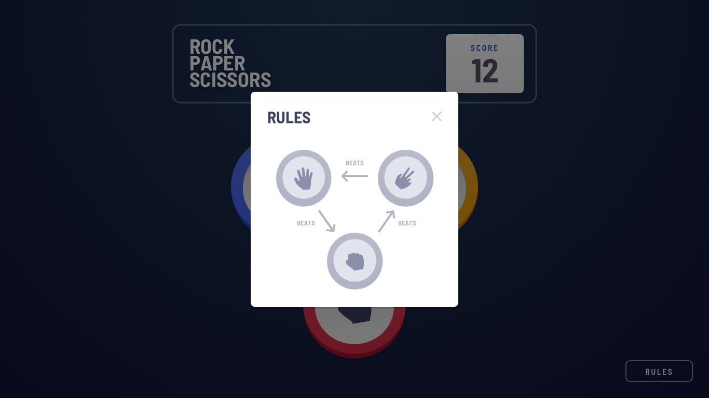

# Rock, Paper, Scissors — Dual-Mode Game

A fully responsive Rock, Paper, Scissors game with a bonus Rock, Paper, Scissors, Lizard, Spock variant. Built with semantic HTML, modern CSS (custom properties, `clamp()`, `min()`/`max()`), and vanilla JavaScript — zero frameworks, zero build step.

**Challenge:** [Frontend Mentor](https://www.frontendmentor.io/challenges/rock-paper-scissors-game-pTgwgvgH)

## Table of contents

- [Overview](#overview)
  - [The challenge](#the-challenge)
  - [Screenshot](#screenshot)
  - [Links](#links)
- [My process](#my-process)
  - [Built with](#built-with)
  - [Architecture & design decisions](#architecture--design-decisions)
  - [What I learned](#what-i-learned)
  - [Continued development](#continued-development)
  - [Useful resources](#useful-resources)
- [Author](#author)

## Overview

### The challenge

Users should be able to:

- View the optimal layout for the game depending on their device's screen size
- Play Rock, Paper, Scissors against the computer
- Play the bonus variant — Rock, Paper, Scissors, Lizard, Spock
- Toggle between game modes without losing state
- Maintain the score after refreshing the browser (persisted to `localStorage`)
- View the rules modal for both game modes
- Navigate the full game loop using only a keyboard
- Receive screen reader announcements for results, score changes, and mode switches

### Screenshot

| Original mode — Pick phase (mobile) | Bonus mode — Pick phase (mobile) |
|-------------------------------------|-----------------------------------|
|  |  |

| Reveal phase (desktop) | Rules modal (desktop) |
|------------------------|----------------------|
|  |  |

### Links

- Solution URL: [github.com/AskTiba/rps-v](https://github.com/AskTiba/rps-v)
- Live Site URL: [rps-v-blush.vercel.app](https://rps-v-blush.vercel.app/)

## My process

### Built with

- **Semantic HTML5** — landmarks, ARIA roles, accessible modal dialog, focus trapping
- **CSS custom properties** — theme tokens, responsive scaling via `clamp()`, mode-specific overrides
- **Flexbox** — scoreboard layout, game board centering, reveal-phase positioning, modal structure
- **CSS `min()` / `max()` / `clamp()`** — fluid typography and sizing without media query breakpoints
- **Mobile-first responsive workflow** — base styles for 375px, progressive enhancement at 768px
- **Vanilla JavaScript** — game logic, DOM manipulation, event delegation, `localStorage` persistence
- **No frameworks, no build step** — the entire project is static HTML + CSS + JS

### Architecture & design decisions

**Why vanilla (no frameworks):** This project deliberately uses zero frameworks or build tools. The game has ~300 lines of logic, one piece of state (score), and three screens (pick, reveal, rules modal) — a framework's reactive diffing, component tree, and bundler add complexity without benefit. Vanilla JS keeps the deploy trivial (static files, no `node_modules`), eliminates dependency vulnerabilities, and, most importantly, demonstrates direct DOM manipulation, state management, and CSS architecture skills that frameworks abstract away. For a portfolio project, proving you can work *without* a framework is stronger than proving you can use one.

**Dual-mode architecture:** The app supports two distinct game modes sharing a single render pipeline. A `MODES` configuration object drives everything — move sets, rules engines, background SVGs, logos, rules images, and `localStorage` keys. Adding a new mode is a data change, not a logic change.

**Rules engine:** The RPSLS variant uses an array-based lookup (`rules[player] = [beaten1, beaten2]`) compared to the original's single-beat mapping. The `getResult()` function handles both uniformly via `Array.includes()`, keeping the game logic mode-agnostic.

**Responsive circle sizing:** Game circles derive from a single `--circle-size` custom property. On desktop, `clamp(7.5rem, calc(30vh - 4rem), 16rem)` ties circle dimensions to viewport height — circles grow on taller screens and shrink on shorter ones. The bonus mode reduces the floor and ceiling proportionally to fit 5 buttons instead of 3.

**Reveal-phase alignment:** Desktop reveal circles are visually offset via CSS `transform: translateX()` so their centers align with the scoreboard's left and right edges. The offset is computed dynamically from `100vw`, the scoreboard width (`min(50vw, 700px)`), and the current circle size — no JavaScript layout measurement needed.

**Proportional gradient rings:** The white inner circle of each choice button uses `calc(100% - var(--circle-size) * 0.2)` — the gradient ring thickness scales with the circle size, maintaining consistent visual proportions across all breakpoints and both modes.

**CSS coupling trade-off:** Everything circle-related derives from a single `--circle-size` property — button dimensions, inner rings, pentagon container, icon sizes, and the reveal alignment formula. This is intentional for a fixed-spec project: it guarantees proportional scaling across viewports and eliminates the risk of misaligned SVG vertices. The trade-off is tighter coupling — if future requirements demanded independent sizing for picks versus reveal circles, `--circle-size` would need splitting into intent-specific variables (e.g., `--choice-size`, `--reveal-size`). For this project's scope, the single-source-of-truth approach produces less code and fewer failure modes than a fully decoupled set of variables.

**Pentagon layout (bonus mode):** Five choice buttons are positioned at percentage coordinates derived from the background SVG's path vertices, centered via `transform: translate(-50%, -50%)`. The container dimensions are proportionally tied to `--circle-size` to match the SVG's native aspect ratio.

**Winner glow animation:** A `::after` pseudo-element with three concentric `box-shadow` rings creates a pulsing highlight around the winning choice. The glow scales proportionally with `--reveal-circle-size` via spread-radius calculation.

**Keyboard navigation & focus management:** The rules modal traps Tab focus within its focusable children. The Play Again button receives focus when a round result appears. The first choice button receives focus on game reset. All interactive elements use `:focus-visible` outlines.

**Accessibility:** An `aria-live="assertive"` region announces round results and mode changes. The score display uses `aria-live="polite"`. The result text has `role="status"`. The mode toggle button has a dynamic `aria-label` reflecting the current mode.

### What I learned

**CSS `clamp()` for fluid component sizing:** Tying `--circle-size` to viewport height with `clamp()` creates a responsive system where game elements scale naturally across device sizes. The formula `calc(30vh - 4rem)` ensures circles grow at a controlled rate, while the `min`/`max` bounds prevent them from becoming unusably small or comically large.

```css
:root {
  --circle-size: clamp(7.5rem, calc(30vh - 4rem), 16rem);
}
```

**Dynamic button rendering from a data config:** Replacing hardcoded HTML buttons with JS-generated elements driven by a configuration object made the dual-mode toggle trivial. The `renderChoices()` function iterates the current mode's move array, creates buttons with the correct class, icon, and event listener — no conditional branches needed.

```js
function renderChoices() {
  const mode = MODES[currentMode];
  choicesEl.innerHTML = '';
  choicesEl.className = `choices ${mode.choicesClass}`;
  for (const move of mode.moves) {
    const btn = document.createElement('button');
    btn.className = `choice ${CHOICE_CONFIG[move].className}`;
    // ...
  }
}
```

**CSS `min()` inside `calc()` for cross-property math:** Using `min(50vw, 700px)` inside a `calc()` expression made it possible to reference the scoreboard's capped width directly in the reveal-circle alignment formula — no media query forks needed for the 700px cap breakpoint.

```css
.reveal__column:first-child {
  transform: translateX(
    calc((100vw - 4rem - var(--reveal-circle-size) - min(50vw, 700px)) / 2)
  );
}
```

**Focus management in dynamic UIs:** Managing focus across dynamically appearing elements requires sequencing `focus()` calls after DOM updates. The Play Again button doesn't exist until the result phase renders it, so the focus call uses `requestAnimationFrame()` to ensure the element is in the DOM before attempting to focus it.

**LocalStorage key isolation per mode:** Each game mode uses its own storage key (`rps-score` / `rpsls-score`), preventing scores from colliding when the user toggles between modes. The `setupMode()` function handles key selection through the mode config.

### Continued development

- **Animations:** Add transition animations for mode switching and round transitions (choice selection, reveal, score update) for a more polished feel.
- **Screen reader testing:** Validate with NVDA and VoiceOver to ensure all dynamic updates are announced correctly.
- **Offline support:** Add a service worker for full offline play capability.
- **Round history:** Track and display round history (win/loss/draw streaks) within a session.

### Useful resources

- **[CSS `min()`, `max()`, and `clamp()` — MDN](https://developer.mozilla.org/en-US/docs/Web/CSS/clamp)** — Essential reference for fluid responsive sizing without media queries.
- **[ARIA Authoring Practices Guide — Modal Dialog](https://www.w3.org/WAI/ARIA/apg/patterns/dialog-modal/)** — Used to structure the rules modal with proper focus management and `aria-modal`.
- **[Frontend Mentor Style Guide](./style-guide.md)** — The project's color tokens, font specs, and layout breakpoints that drove the CSS custom property system.

## Author

- **Tibamwenda Anthony** — Frontend developer focused on accessible, performant, vanilla web experiences
- GitHub — [@AskTiba](https://github.com/AskTiba)
- Frontend Mentor — [@AskTiba](https://www.frontendmentor.io/profile/AskTiba)
- LinkedIn — [Anthony Tibamwenda](https://www.linkedin.com/in/anthony-tibamwenda-64144820b/)
